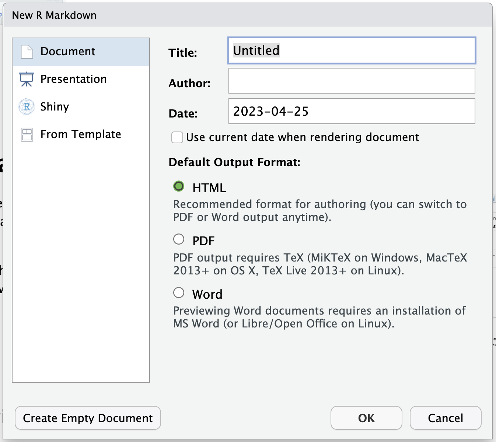

Objectives

-   Get started with project organization in R studio
-   Familiarize with the R studio interface and basic R syntaxt
-   Conduct advanced data handling, validation, and manipulation
-   Compute summary statistics with data
-   Introduction to visualization of data

------------------------------------------------------------------------

# Setting up your environment

## The Rstudio interface

When we start R studio, we can see 4 sections:

1.  **Source** (top left), here we have our code editor and other files.
    We will use this section to edit and view our scripts and other
    documents we will be using to interact with R.
2.  **Console and Terminal** (bottom left), this is where the code is
    executed (*Console* will execute R code and *Terminal* other code
    for your operating system). We can directly write the code here, but
    normally we will be using the other source files such as .R or .Rmd
    to write our code which then will be send here.\
3.  **Environment, History and others** (top right), Environment will
    list all the objects you create and History will have the code you
    sent to the console. There are other tabs in this section which we
    wont be using for now.
4.  **Files, Packages and Help** (bottom right). This section includes a
    file browser, and other tabs for package management and help.


## Organizing your projects

One of the most useful features of R studio is the project organization,
if you haven, I strongly encourage you to familiarize with creating and
using projects to organize your workflow. Projects allow to create a
file that will contain all the information regarding your session
(including objects, data sets and configurations) and organize your
files in folders in your system. This is particularly useful when we are
working with multiple topics.\
When you open Rstudio for the first time it starts on an empty project.
To create a new project, just go to the top right corner menu and select
*New Project...*


Then will five you the option to create a new project in a new
directory, un an existing directory or version control. For today, we
wont be talking about version control in detail, but this is to
integrate Rstudio with Github.


Once you have selected the option that you want, it will show you
multiple options for types of projects, you can select *New project* and
continue.


Then you just name your directory and select a location.


Once the project is created, in the files tab you will see that Rstudio
created the files for your project in the folder that you selected. The
project organization depends on your personal preferences, but I usually
like to create 3 folders (code, data and docs) to organize my files
related with the current project.


## Intro to Markdown

{style="float:right" width="16%"}

R studio can create several types of documents including: R scripts,
text files, Markdown, among others. To create a new document you can go
to the menu located at the upper left corner.

A menu will show with all the different document types you can create.
For now we will select the option *R Markdown...*.

It might ask you to install a library if it's not already installed, so
just click yes if it does. This will open a window where will ask for a
title, author, date, and some options for the type of output of the
document. Add your name and select the render format to word (this can
be changed later).



## Documents with R Markdown (.Rmd)

We created our first document with R Markdown, and will look like this:


The document has already the header and a code 'chunk' (we will talk
more about this later). Add a title for the document and put your name
in the author field. The Rmd documents use a syntax called markdown
which we will not cover in detail, but you can find more info in [this
link](https://www.rstudio.com/wp-content/uploads/2015/02/rmarkdown-cheatsheet.pdf).
You can edit the document directly with the Rmd syntax, but if you
prefer to save some time and don't have to deal with learning everything
from scratch, there is an option to edit the document in a more familiar
way. To do this just change the option located in the top right of the
document from *Source* to *Visual*. You will notice that a toolbar with
some familiar icons appeared at the top.


To add a new section to the document, you might want to start with a
title. The titles can be hierarchical similar to what we are used in
other text editors (Title, Subtitle 1, Subtitle 2, etc...). To define a
new title we use the character `#` in front of the text, and the number
of `#` before the text will be the hierarchy level. For example if we
want to define a title hierarchy we write:

```         
# Title 1

## Subtitle 1

### Subtitle 2
```

Which in our visual and rendered document will look like this:


### Navigating the document

Having defined sections in our document is nice because we can quickly
jump between them. There are 2 ways of quickly navigating between
sections: the *outline right bar* and the *bottom outline menu*. If your
right outline bar is collapsed, make sure to click on the outline icon
{width="10%"}


You will notice that the bottom outline has a few extra sections labeled
*Chunk*. A chunk refers to a piece of code in the document. This piece
of code will execute (unless you specify the opposite) every time that
you document renders. Each document is self contained which means taht
all the objects and functions you use must be declared and loaded in
order for the document to render properly (we will talk more about this
later).

### Rendering the document

Now that we have a document we are going to render it to different
formats. To render the document you can either click on the *knit* icon
{width="10%"}, or use the shortcut
`ctrl+shift+k`. The default format that the document will be rendered is
html, but you can choose different formats from the dropdown menu.


------------------------------------------------------------------------

# Getting started

## Objects in R

R is an [object
oriented](https://en.wikipedia.org/wiki/Object-oriented_programming)
programming environment, which means that we store the information in
variables called objects. To create a new object we use the assign
operator, `<-` or `=`. For example:

```{r creating objects}
# we will create an object called "num" that contains the value 10
num <- 10
```

When creating an object, we will not see any outputs. If we want to see
what is inside an object, we have to print the object by typing it on
the console.

```{r printing objects}
# This will print the information stored in the object
num
```

## Storing multiple elements

We can store more than one element inside an object. This can be
arranged in multiple structures. The most simple is a *vector* of
values. For example:

```{r vectors}
# Store multiple elements inside a vector
numbers <- c(10, 40, 25, 3)

# Examine the result
numbers
```

<!-- There are multiple ways of storing information inside objects, another way is using lists. Lists are more flexible than vectors since we can store different type of information. For example, in the next chunk of code, we will store information in the way of a numeric value and a string of characters: -->

<!-- ```{r lists} -->

<!-- values <- list(3, "five", 9, "10") -->

<!-- # print the list we just created -->

<!-- values -->

<!-- ``` -->

## Subsetting objects

We can select specific elements inside our objects. For this we can use
indexing by position and use the operatoors `[ ]`. For example:

```{r subsetting elements}
# We can ask for the third element of our object values
numbers[3]
```

## Boolean logic

Other important concept in programming is Boolean logic. Boolean logic
is a conditional statement with two possible outcomes: `TRUE` or
`FALSE`, this is used a lot for decisions and controlling the flow of a
program. The basic operators we use for this in R are:

-   Equal to (`==`)
-   And (`&`)
-   Or (`|`)
-   Not (`!`)
-   greater (`>`) or less (`<`) than

This operators can be combined. For example, if we want to make a
statement about a variable `x` not equals to variable `y`, we can us the
operator `!=` to define the statement. In the following example we
compare the 2 values to evaluate if they are the same:

```{r boolean logic}
test <- numbers[1] == numbers[2]

test
```

## Functions

R has a lot of base functions, but we can define new functions. When
using R studio, the key *Tab* will help us to auto complete, this can
help us a lot when we don't remember the exact name of the functions
available. The best part of programming with R is that it has a very
active community. Since its open source, anyone can create functions and
compile them in a package (or library). we can download these packages
and access new functions.\
Functions in R require arguments, which we can see in the function
documentation or if we press the key *Tab* when we are inside the
function.

```{r functions}
# To get the sum of a vector of numbers inside an object we use sum()
sum(numbers)
```

We can put functions inside function, for example, to get
$\sqrt{\sum_1^n x}$ the square root of a sum of the numbers in x we can
use:

```{r nested functions}
sqrt(sum(numbers))
```

You can find the documentation regarding the functions, including the
arguments (expected inputs) and outputs generated, typing in the R
console the operator `?` followed by the name of the function.


## Introducing the pipes

The library `dplyr` has several functions that can help to clean, create
new variables, and modify our data in other ways.

```{r message = F}
# if we don't have installed the library we will need to install it using:
# install.packages("dplyr")
# we load the library:
library(dplyr)
```

`dplyr` introduces a new operator called *pipes* (`%>%`), which can
connect several functions to an object. This is an alternative to write
several functions in a single "line of code" in a more organized way.
For example, if we want to execute a function `F1()` followed by another
function `F2()` for the object `x`:

`F2(F1(x))` is equivalent to `x %>% F1() %>% F2()`

As you can notice, to read the code `F2(F1(x))` we have to go from the
inside to the outside to see the order of execution of the functions,
but when we read `x %>% F1() %>% F2()` we read from left to right, which
is the same way we normally would read any text in western language.

**Suggestion:** we can use the keys *Ctrl* + *shift* + *m* to insert the
`%>%` operator.

```{r pipes}
# We previously used this code to calculate the square root of the sum of x
sqrt(sum(numbers))
```

Using the pipes we can do the same more organized, by writing the order
of execution from left to right.

```{r pipes II}
numbers %>% # First we call the data
  sum() %>% # Sum all the values
  sqrt() # Compute the square root
```

You will notice that the outputs are exactly the same. Feel free to use
whatever syntax you prefer, but for this course we will use mostly the
pipes and writing the code from left to right.

------------------------------------------------------------------------

# Data manipulation

Now we will import some data into R, here is where the project
organization becomes handy... To import the data into R we need to know
the location in our computer, and specify the *path* to the file. For
example, I have the file located in a directory called data.

```{r importing the data}
# Import the data
dat <- read.csv(file = "data/dataTb.csv")

# With the function head() we can see the first n observations of our data.frame
head(x = dat, n = 5)
```

## Examining the data

We can examine the structure of our data with the function `str()`. This
will show us the dimensions of our table, the name of the variables,
type and the first values for each column.

```{r examine the data}
str(dat)
```

We can subset specific rows and columns of our data. If you remember, we
previously used the operator `[]`. Since our object containing the data
is a data.frame and has named columns, we can use the operator `$`, that
is used to subset named elements of an object. For example:

```{r}
# Subset the first 5 observations of the col Mun
dat$Mun[1:5]
```

## Types of variables

There are different types of variables in R, so far we have used the numeric and string types. If yo want to know what kind of variable is a given object, you can use the function `class()`. Lets try it.

```{r variables I}
class(dat$Com)
```

The most commonly used types of variables include:

  - *numeric* This are continuous numeric variables WITH any decimal values. For example: KG of product imported, probability of an event happening.
  - *integer* These variables are whole numbers WITHOUT decimal values. For example: Number of animals, number of shipments, etc..
  - *character* Alphanumeric variables. For example: name of a region, name of a disease, farm ID.
  - *factor* Alphanumeric variable with specific categories or levels. For example: type of product imported, type of farm, etc...
  
### Factors in R

The alphanumeric variables can come in two different forms in R. Character are usually variables without specific levels or categories, while factors are variables with specific levels. we can convert some of our variables to factors. For example:

```{r converting to factor}
dat$Com <- factor(dat$Com) # Convert to factor
class(dat$Com) # Verify what type of variable is
```

## Summary statistics

We can obtain summary statistics for the variables using the function `summary()`. The result will depend on the type of variable use use as argument for the function. For example, numeric variables we will obtain:

```{r summary numeric}
summary(dat$Census)
```


So far, we have used only base R to manipulate our data. In the next
section, we will use the library `dplyr`, which several provides
functions for data manipulation.

## Data reduction

### Subsetting columns

The function `select()` can be used to pick variables based on their
names. For example

```{r subsetting columns, eval = F}
# Here we select only the variables Mun, Census, and Prev
dat %>% # This is the name of out table
  select(Mun, Census, Prev) # we define the columns we want
```

```{r subsetting columns hidden, echo=F}
# Here we select only the variables Mun, Census, and Prev
dat %>% 
  select(Mun, Census, Prev) %>% 
  head()
```

### Subsetting rows

dplyr has two main functions to subset rows: `slice()` and `filter()`.
`slice()` will subset the rows based on their index. For example, if we
want the rows 1 to 10:

```{r slice}
dat %>% 
  slice(1:10)
```

Since the rows are not named, we use their indices, which is not very
useful.

A more useful way to select rows, would be based on conditions, for this
we can use our previous knowledge on boolean logic. For example, if we
want to create a subset of all the beef farms we use:

```{r data reduction code}
beefFarms <- dat %>% 
  filter(Type == "BEEF")

head(beefFarms)
```

## Creating new variables

Often times we will need to create new variables based on the
information we have. In the following example, we will use the function
`mutate()` to create a new categorical variable for the size of the farm
based on the census recorded. Notice that we use the function `cut()` to
create the

```{r creating new variables}
# Create new variable for farm size
dat <- dat %>% # this is the data used
  mutate( # We use the function mutate for creating new variables
    # We will use the function cut() for categorization
    farmSize = cut(
      Census, # Name of the variable used for categorization
      breaks = c(0, 50, 200, 10e3), # Breaks used to create the categories
      labels = c("small", "medium", "large") # Names for each of the categories
    )
  )

# print the first observations
head(dat) 
```

## Summarizing the data

### Number of observations

There are multiple ways to obtain summaries by groups in R. The most
basic is counting the number of observations for each category of a
variable. For example, we use the function `count()` to count the number
of farms for each of the categories we just created:

```{r counting variables}
dat %>% 
  count(farmSize)
```

We can add multiple variables to count the number of observations for
each of the combinations between levels. For example:

```{r multi counting}
dat %>% 
  count(farmSize, Type)
```

### Other summary statistics

We can also compute other summary statistics such as median, mean,
standard deviation, or any other function in R. For example:

```{r}
dat %>% 
  group_by(farmSize) %>% # We group by farm size
  # we use the function summarise to get the summary statistics
  summarise(
    count = n(), # we use the function n() to get the counts
    medianPrev = median(Prev), # mean() to get the mean 
    maxPrev = max(Prev) # sd() for the standard deviation
  )
```

The functions `mutate` and `summarise` in `dplyr` have some variants
that allow to do multiple operation for multiple variables, which makes
the manipulation more flexible. For example if we want to calculate the
standard deviation and mean for multiple variables, we can use:

```{r}
dat %>% 
  group_by(farmSize) %>% 
  summarise_at( # Notice that we use the function `summarise_at()` this time
    vars(Prev, ANIM_mov),  # first we specify the names of the columns
    list(median = ~median(.), max_value = ~max(.), count = ~n()) # Then we specify the functions we want to use
  )
```

# A glimpse into data visualization

To finalize this lab, we will do a little glimpse into data visualization. For today we will keep it simple and just use the base R functions.  

The choice of which type of figure we will use will depend on the type of variables we are using. 

For example, to visualize continuous distributions we can use a histogram

```{r hist}
hist(dat$Prev)
```


If we want to plot two continuous variables we can use a scatter plot:

```{r scatterplot}
plot(dat$Census, dat$Prev)
```

If we want to visualize the relationship between a categoricla and a continous variable we can use a boxplot:

```{r boxplot}
boxplot(dat$Prev~dat$farmSize)
```

Next week we will go more in detail into how to make our figures pretty ✨


------------------------------------------------------------------------

# QUESTIONS

Render the document using the Rmd engine and submit your responses as a
word document or pdf. **DO NOT SUBMIT IT AS A HTML or Rmd.**

1.  How many rows and columns do you have in the dataset "dataTB.csv"?
    Using R, provide a table displaying the information contained in the
    10 first rows of the six first columns.
    
2. What type of variable is the column Prev? prove the range of values for this variable in the data

3. What happens when you use the function `summary()` on a variable of class factor? try using it on the variable *Com* and report your findings. Note: make sure the variable is a factor and not a character.

4.  Provide a table of the beef farms where the number of movements are
    more than 500, only including the columns: *ID_farm*, *Mun*, *Com*,
    *Census* and *ANIM_mov*

5.  Bonus: Create a boxplot displaying the TB prevalence by county.

------------------------------------------------------------------------

# Appendix I: Data dictionary


