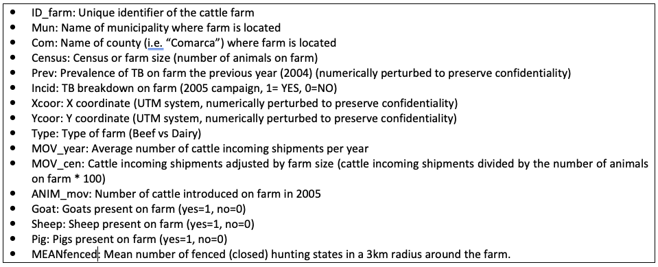
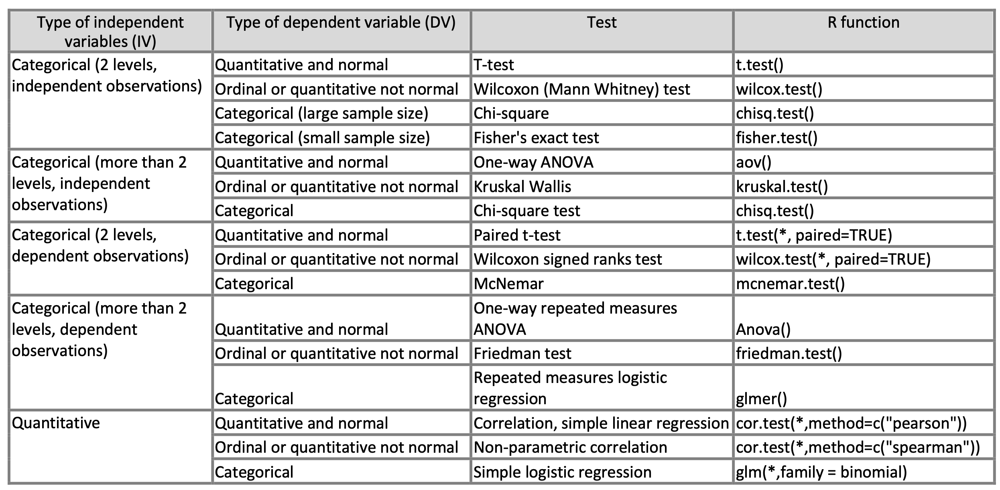

# Objectives
  
  - Select the appropriate statistical test and graphical methods to compare groups and analyze different types of epidemiological data using R language.
  - Be able to properly interpret the results of those statistical tests.
  - Get further insight into the use and implementation of R environment for analysis of epidemiological data.
  
# Instructions
  
  - Follow the guidelines and answer the questions. Remember to send the answers in a pdf document labeled as “YOUR_LAST_NAME_Lab 5” using CANVAS before 12:00pm, February 13th.
  - Do not hesitate to ask the instructor if you have any questions.

We will continue using the dataset provided dataTB.txt contains the following information regarding cattle farms in Ciudad Real during 2005:



The table below will provide you general guidelines to choose the appropriate statistical test for the different exercises of this lab. Have a look at it and continue reading below.




We are going to start exploring the potential association between hypothesized risk factors and TB prevalence
and/or incidence, using bivariate analysis but, first, answer QUESTION 1 and 2.
5) The regional veterinary authorities of Ciudad Real (i.e. our study region) believe that the TB prevalence in Beef
farms is significantly higher than the prevalence in Dairy farms, however, they failed to find any statistical
association (using a t-test). Answer QUESTION 3 and 4.
6) Continue exploring the other variables in the dataset and their potential associations with TB prevalence or TB
incidence on the farm. Answer QUESTION 5 and 6.

```{r setup, include=FALSE}
knitr::opts_chunk$set(echo = TRUE, message = F, warning = F)
```

# Loading the data

First we will load the libraries we will use and the data that we previously used on Lab 3. Remember changing the path to the location of the data in your computer:

```{r load the data}
# Load libraries --------
library(dplyr) # for data manipulation
library(ggplot2) # For visualization

# Load data ----------
EJ <- read.csv("data/dataTb.csv")

# We will recode some of the variables
EJ <- EJ %>% 
  mutate(
    catCensus = cut(Census,breaks=quantile(EJ$Census), include.lowest=TRUE), #Create a categorical variable using quantiles
    census_b = ifelse(Census > median(Census),1,0) # Create a binomial variable (YES/NO~1/0) using the median as cut-off point
  )
```

Now we will examine the normality of some of the variables

```{r examine normality of the data}
par(mfrow=c(2,3),mar=c(4,4,4,4))
qqnorm(EJ$Prev)
qqnorm(EJ$Census)
qqnorm(EJ$MOV_year)
qqnorm(EJ$MOV_cen)
qqnorm(EJ$ANIM_mov)
qqnorm(EJ$MEANfenced)
```

We can examine some of the variables using different functions:

```{r examine variables}
## some useful functions to know more about the type of variables of your database#
str(EJ)
typeof(EJ$Census)
summary(EJ)
```

# Examine normality of the variables:

```{r}
## Best choice is to graphically evaluate your data ##
## histograms ##
ggplot(data = EJ) +
  geom_histogram(aes(Prev))

ggplot(data = EJ) +
  geom_histogram(aes(Census))
```

```{r}
## normal quantile-quantile plots ##
ggplot(data = EJ, aes(sample = Prev)) +
  stat_qq() +
  stat_qq_line()

ggplot(data = EJ, aes(sample = Census)) +
  stat_qq() +
  stat_qq_line()
```


```{r}
## boxplots ###
ggplot(data = EJ) +
  geom_boxplot(aes(Prev))

ggplot(data = EJ) +
  geom_boxplot(aes(Census, Type))
```

```{r using shapiro test}
##### alternatively #####
## I don't like and I do not recommended to use...but there are also some normality tests ##
## e.g. Shapiro-Wilk normality test ##
#H0: sample comes from a normal distribution, if W is small and p<0.05, we reject H0. ## 
shapiro.test(EJ$Prev) ##p-value here gives you the probability that the sample comes from a normal distribution(p-value <0.05, sample deviates from normality)
```


```{r}
#similar test than the above will be the Anderson-Darling test for normality:#
# install.packages("nortest")
# library(nortest)
# ad.test(EJ$Prev) 
```

# Bivariate analysis

## T test

```{r}
### one and two-sample t-test ####
    # use "?t.test" to know more about this function##
t.test(Census~Type, data=EJ)
```

## Wilcoxon

```{r}
### Wincoxon (or Mann-Whitney test) ###
    # use "?wilcox.test" to know more about this function##
wilcox.test(Census~Type, data=EJ)
wilcox.test(Census~Type, data=EJ, exact=TRUE,alternative="greater", conf.int=TRUE)
  ##alternatively, the same thing than above:###
  wilcox.test(EJ$Census[EJ$Type=="BEEF"], EJ$Census[EJ$Type=="DAIRY"], exact=TRUE,alternative="greater")
```

```{r eval = F}
## to compute exact p-values with ties (i.e. ties="zeroes" --> a tie occur when the value of the observation is equal to the hypothesized median##
install.packages("coin")
library(coin)
# use ?wilcox_test to know more about this function##
#you may try to run the two next lines below but may take time!...
#w<-wilcox_test(Census~Type, data=EJ, distribution="exact",alternative="greater", conf.int=TRUE)  ##note that this may take time as it is an exact calculation!!
#print(w)
wilcox_test(Prev~factor(goat), data=EJ, distribution="asymptotic",alternative="greater", conf.int=TRUE)
wilcox_test(Prev~factor(goat), data=EJ, distribution="exact",alternative="greater", conf.int=TRUE)
```

## Chi-squared

```{r}
## Pearson's Chi-squared test ###
  # use ?chisq.test to know more about this function##
chisq.test(EJ$Incid, EJ$census_b)
```

## Fishers

```{r}
## Fisher's exact test  ###
  # use ?fisher.test to know more about this function##
fisher.test(EJ$Incid, EJ$census_b)
```

## Kruskal-Wallis

```{r}
### Kruskal-Wallis Rank Sum Test ###
    # use ?kruskal.test to know more about this function##
kt<-kruskal.test(Census~Type, data=EJ)
print(kt)
str(kt)  ##to explore more about the structure of this function and being able to call specific terms as below #
kt$statistic ## to get only the Kruskal-Wallis chi-squared statistic #
kt$p.value  ## to get only the p-value ##
```

## Pairwise differences

```{r}
##pairwise differences ###

pairwise.wilcox.test(EJ$Prev, EJ$catCensus, p.adj="bonferroni", exact=F, paired=F)
```

## ANOVA

```{r}
### Analysis of Variance ###
av<-aov(EJ$Prev~EJ$catCensus)
summary(av)
print(av)
coefficients(av)
par(mfrow=c(2,2), mar=c(4,4,4,4))
plot(av)
```

## Correlation

### Pearson

```{r}
#### Correlation tests ###
#Pearson correlation##
cor.test(EJ$Prev, EJ$Census, method=c("pearson"))
```


### Spearman

```{r}
#Spearman correlation##
cor.test(EJ$Prev, EJ$Census, method=c("spearman"))
cor.test(EJ$MOV_year, EJ$Census, method=c("spearman"))
```


## Regression

```{r}
#simple logistic regression##
m1<-glm(EJ$Incid~EJ$Census, family=binomial(link="logit"))
summary(m1)
```

# Questions

  1. What type of variables do you have in the “dataTB” database? Provide a table in which you include the name of the variable in the first column and the type of variable in the second column (i.e. use for the type of variable the term “categorical”, “ordinal” or “quantitative”). [TIP: no need to do the table in R, just use `str()`, `typeof()` and `summary()` functions to support the creation of the table].
  2. Are all the quantitative variables of your database normally distributed? Use graphs to support your answer. Provide two figures: one for the histograms and other for the quantile-quantile plots to support your answer [TIP: use `par()` `hist()` and `qqnorm()` functions].
  3. Do you believe that the t-test is the best option to respond to this question? Justify your answer. Try to reproduce the analysis conducted by the regional veterinary authorities (i.e. t-test) and provide the code and the results.
  4. Which (more appropriate) statistical test would you use to support (or reject) with statistical evidence the hypothesis of the regional veterinary authorities? Provide the R-code to run the statistical analysis, the results and an interpretation of your findings. [Note: consider the information obtained in question 2 and the table provided above to decide the appropriate type of test to use]. Compare this result with the one obtained in question 3.
  5. Statistically evaluate whether or not there are significant differences in TB prevalence in the four categories of farms using the EJ$catCensus variable. Which test would you use for this? Provide the R-code, the results and the interpretation of your findings. Also provide a boxplot to support your results [Tip: use the boxplot () function].
  6. Select an appropriate test to evaluate the statistical association between TB prevalence and a) the number of incoming shipments of cattle per year, b) presence or absence of sheep on farm and, c) mean number of fenced hunting states in a 3km radius around the farm. Provide the code, the results and an interpretation of your findings. Now, do the same but with TB incidence (using the same 3 predictors)