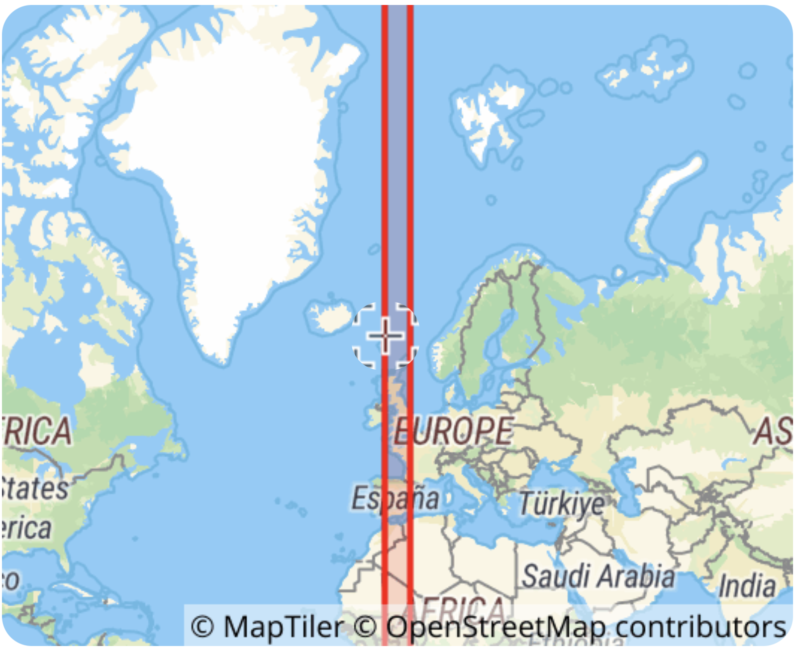

```{r setup, include=FALSE}
knitr::opts_chunk$set(warning = F, message = F)
```


# Introduction.  

Spatial data is usually represented in two different ways:  

  - *Vectors*: Represent objects in different dimensions.  
  - *Raster*: Represent continuous values in a grid.  
  
## Spatial objects in R.  

In this exercise we will introduce to spatial data manipulation in R.  
There are two main formats to manipulate spatial data in R:  

  - **SpatialDataFrame** from the `sp` package: This is was the first format introduced in R for spatial data manipulation, therefore, this package has a lot of dependencies (packages that uses this format to do other functions) i.e `raster`, `spdep`, `spstat`.  
  
  - **Simple features** from the package `sf`: This is a more recently developed package, this package was developed to be more intuitive and friendly with other packages such as `dplyr`. The problem with this package is that since its more recent, some packages doesn't support this format.  
  
Working with both formats has its advantages, for spatial data manipulation `sf` is more intuitive and powerful, but for spatial analysis `sp` is more robust.  

Here we will use mostly the `sf` package, but there will be times that we will need to switch between formats.  
  
________________________________________
  
# Vector data

Spatial objects can be represented in multiple dimesions:  

  - *Point*, is the most basic form of representing spatial data. It contains only the spatial coordinates of an even or object. For example, we use this to represent the spatial location of a farm, a capture of an animal or a case report.  
  - *Line*, Includes the spatial location of an object and the direction. we can use lines to represent a road, a river or a route.  
  - *Polygon*, Includes the spatial location and geometry of an object. We use polygon data to represent the shape of a building, lake or a administrative area.  
  
Besides having the location of an object, we can include other characteristics such as the name, id, temperature recorded, number of animals in the farm, etc...  

## Components of spatial datasets

There are multiple ways to loading spatial data into R, we will use the function `st_read()` to load the data contained in the STNet library. lets get started:

```{r}
# Loading the libraries
library(sf)
library(dplyr)
library(ggplot2)
library(geodata)

# set a default theme for the plots generated
theme_set(theme_bw())
```

```{r getting the data}
# Get the map for spain ----------
es <- gadm(
  country = "ES", # ISO code for the country
  level = 3,  # Administrtive level
  path = tempdir(), # output directory to store the data (just use a temp dir for now)
  resolution = 2 # resolution of the data
) %>%
  st_as_sf()

# we will examine the first 6 rows
head(es)
```

The output shows:  
  - `geometry type`: The type of shapefile (either point data, lines or polygons).
  - `dimension` Dimensions used in the data.  
  - `Bounding bix`: The extent of our data.  
  - `CRS`: The coordinate reference system.  
  - And the first 10 features.  
  
**What is the coordinate reference system?:** The coordinate reference system (CRS) is a format to specify the scale for the coordinates being used to describe the location of our data. The most commonly used CRS is WGS84, which provides the latitude and longitude values in a scale of -90 to 90 for latitude and -180 to 180 for longitude. This CRS is ideal to report locations in a map but it is important to consider that does not takes into account the curvature of the earth, which is an important factor when we are measuring distances.  
  
To see the full description of the CRS from a spatial object we can use the function `st_crs()`: 

```{r}
# examine the CRS
st_crs(es)
```


The `sf` objects are basically a data.frame with extra information about geometry, projection and CRS. We can plot our polygon using the same syntax we used previously from `ggplot2`:

```{r plot the country}
ggplot() +
  geom_sf(data = es)
```

The whole data set is a shapefile of Spain aggregated at the administration level 3. Since we will not be using the whole country for our analysis, we will filter the data only for the study region. We can use the same function `filter()` we are already familiarized with:

```{r manipulating spatial data}
# Filter to our study area
area <- es %>%
  filter(NAME_2 == "Ciudad Real") %>% # select only ciudad real
  select(community = NAME_1, prov = NAME_2, com = NAME_3) # subset and rename the columns

area
```

Our spatial data is in the WGS84 CRS, which is a non-projected format. Good for locations, bad for measuring distances. The impact of the projection in our data will be associated with the size of our study area. In smaller areas the projection wont have a big impact, but as our study are increases the projection will have a bigger impact when calculating distances.  

```{r plot the study are}
# plot the subset
ggplot() +
  geom_sf(data = area)
```

We can also extract only the data frame without geometry using the function `data.frame()`:  

```{r}
data.frame(area) %>%
  head() # We use this function to see the first 6 only
```

As you can notice, sometimes the data sources can be outdated and with incomplete names (see column com), for the purpose of this lab we will just leave it like that.


## Point data (converting from a data frame)

We can convert a data.frame with X/Y coordinates to a spatial points if we have the coordinates information, lets try with the dataset we have been using:

```{r}
EJ <- read.csv("data/dataTb.csv") # we load the data
# Lets look at the variables
head(EJ)
```

This data has the column *Xcoor* and *Ycoor*, which correspond with x and y for a spatial coordinate. We can use the function `st_as_sf()` to do this. Which requires 2 arguments: `coords` which are the corresponding names in the data.frame for the x and y coordinates, `crs` the coordinate reference system.

```{r}
EJSp <- EJ %>% 
  st_as_sf(
    coords = c('Xcoor', 'Ycoor'), # the names of the variables with the x and y information
    crs = st_crs(32630) # the CRS for the coordinates
  )

# Lets have a look at our points
ggplot() +
  geom_sf(data = EJSp)
```

*How do I know which projection to use?* We can use tools such as [epsg.io](https://epsg.io/) to look for the area we will be working and identify the most proper projection. In this exercise we will use the EPSG:32630, which covers this region of the world:

{fig-align="center" width="50%"}

## Nearest neighbor

A common statistic calculated for point pattern analysis is the average nearest neighbor distance, which is the average distance of the nearest point to each observation. A small value of average nearest neighbor distance would suggest that our observations are clustered, and a large one that the observations are disperse. Let's calculate that:

```{r nearest neighbor}
dm <- st_distance(EJSp) %>% # get the distance between all pairs of farms
  `diag<-`(NA) # Replace the diagonal of the matrix with NA

EJSp$dmin <- apply(dm, 1, min, na.rm = T) # get the min distance for each farm
EJSp$nn <- apply(dm, 1, which.min) # get which is the nearest farm for each point

# Plot the distribution of the distance by type of farm
ggplot(data = EJSp, aes(x = dmin)) +
  geom_histogram(aes(group = Type, fill = Type)) +
  facet_wrap(~Type, scales = "free") +
  scale_fill_manual(values = c("seagreen", "orchid"))
```
Lwts now compute the average nearest neighbor distance by type of farm:

```{r compute the average nn by type, include=F, eval=F}
EJSp %>% 
  data.frame() %>% # convert to data frame
  group_by(Type) %>% # group by type of farm
  summarise(dmin = mean(dmin)) # get the average nearest neighbor
```


# [Question 1]{style="color: darkred;"}

Now do the same, but based on their incidence (*Incid*, make sure its not interpreted as a numeric variable). Do you think there is a difference in the average distance between the positive and negative farms? what kind of test would you use to test this hypothesis? (hint: remember the tests we talked about on week 5)

```{r answer question 1, eval = F, include=F}
EJSp %>% 
  data.frame() %>% 
  group_by(Incid) %>% 
  summarise(dmin = mean(dmin), n = n())


t.test(dmin ~ Incid, data = EJSp)
```

# [Question 2]{style="color: darkred;"}
Based on the variables you created (*dmin* and *nn*), which is the most remote farm? and how did you conclude that? (hint, you can use the function `arrange()` to sort by a specific variable). Provide the id of the farm

```{r answer q2, include=F, eval=F}
EJSp %>% 
  arrange(-dmin)
```

## Joining spatial objects

So far we have two kind of spatial objects, we can extract the information for the points to the polygons by joining based on where they intersect, for this we can use the `st_join()` function. It is important that the two spatial objects are in the same CRS. We will check if the CRS for the polygon and points match

```{r}
# Check it the crs are the same
st_crs(area) == st_crs(EJSp)
```

Since the CRS are different, we will not be able to join the data. Lets fix that by transforming the CRS. We can use the function `st_transform()` for this task:

```{r transform CRS}
# transform the crs
EJSp <- EJSp %>% 
  st_transform(crs = st_crs(area))

# Put the two datasets in a figure
ggplot() +
  geom_sf(data = area) +
  geom_sf(data = EJSp, aes(col = factor(Incid))) +
  scale_color_manual(values = c("blue3", "red3"))
```

Now that we have both spatial objects in the same CRS, lets try to calculate the proportion of farms that are positive for each administrative unit. 

```{r joining}
joinedSp <- st_join(area, EJSp) %>%  # Join the two data sets
  # Now we will get the proportion for each admin
  group_by(com) %>% # group by com
  summarise(n = n(), Incid = sum(Incid, na.rm = T)) %>% # get the numeber of farms and sum of positive
  mutate(prop = Incid/n) # create a variable for the proportion of positive farms

# Make the figure
joinedSp %>% 
  ggplot() +
  geom_sf(aes(fill = prop)) +
  geom_sf_label(aes(label = round(prop, 2)))
```

# [Question 3:]{style="color: darkred;"} 
Which is the comarca (com) with highest proportion of infected?

## Raster data:

We use raster data to represent continuous values in a field. Raster are just a grid where each cell has a value and in a grid. The resolution of a raster just represent the size of the cells from the grid. We use raster data to represent values such as altitude, temperature, among other continuous values. Here we will use a raster for land cover from the study area. This raster was obtained from [diva-gis](http://diva-gis.org/) and you can get it from canvas.  
To manipulate and process rasters, we will use the library `stars`, so make sure you have it installed using `install.package("stars")`.

```{r process the raster, eval = F, include=F}
# Raster ----
# lc <- raster::raster("data/lc-cr.tif") 
# lc <- raster::raster("data/ESP_cov/ESP1_cov.grd")
# object.size(lc)
# Stars --------
# lc <- read_stars("data/lc-cr.tif")
# lc <- read_stars("data/ESP_cov/ESP1_cov.vrt") %>% 
#   st_transform(crs = st_crs(area)) %>% 
#   st_warp(crs = st_crs(area)) %>% 
#   st_crop(., st_bbox(EJSp))

# names(lc)<- "lc"

# stars::write_stars(lc, "data/ciudad_rea_lc.tif")

# object.size(lc)

# terra ----------
# lc <- terra::rast("data/ESP_cov/ESP1_cov.vrt")

# stars::write_stars(lc, "data/lc_cr.tif")

plot(lc)
plot(area$geometry, add = T)
```

```{r read the raster}
library(stars)
lc <- read_stars("data/ciudad_rea_lc.tif")
names(lc)<- "lc" # set the names of the raster attribute
```

Rasters are basically grids with a specific resolution and a value associated to each pixel. You can see the information it includes by printing the object:

```{r}
lc
```

We can use the function `geom_stars()` to add the data as a layer in a ggplot. 

```{r visualize the raster}
ggplot() +
  geom_stars(data = lc)
```

As you can see, the raster values are interpreted as a continuous variable, which in the case of our raster it's not. The values in our raster are defined in the following table:

{fig-align="center" width="50%"}

We can specify that our attribute is a categorical variable, and assign colors for each category:

```{r}
# first we need to get how many unique categories we have:
n <- data.frame(lc) %>% pull(lc) %>% unique() %>% length

# Then we can just make the figure with ggplot:
ggplot() +
  geom_stars(
    data = lc,  # we specfy the name of the raster
    aes(fill = factor(lc)) # we specify that we will use lc as a factor
  ) +
  geom_sf(data = area, fill = NA, lwd = 0.8, col = "black") + # add the polygons on top
  geom_sf(data = EJSp, size = 0.5, alpha = 0.5) # add the points

```

We can extract the value of a raster to the coordinates of each of the locations from our point data. To do that we can use the function `st_extract()`

```{r extracting information from the raster}
# In this example I am extracting the values 
st_extract(lc, EJSp) %>% 
  head() # and showing the first 6 observations
```

The result is a spatial points dataset with a column with the value for each of the points (rows). 

# [Question 4:]{style="color: darkred;"}

What type of land cover is the most common among the extracted locations? (hint: use the function `st_extract()` and then `count()`). Provide the lc code and name in your answer. If you were testing a hypothesis to evaluate the association with land cover and location of the farms, which test would you use to calculate a p-value?

```{r anwer q4, include=F, eval=F}
st_extract(lc, EJSp) %>% 
  data.frame() %>%
  count(lc)
```
```{r answer q3, include=F, eval=F}
lcpts <- stars::st_extract(lc, EJSp) 
EJSp$lc <- lcpts$lc

EJSp %>% 
  data.frame() %>%
  mutate(lc = recode(as.character(lc), `2` = "tree", `4` = "tree", `6` = "tree", `12` = "shrub", `16` = "cultivated", `22` = "artificial")) %>% 
  xtabs(~lc + Incid, data = .) %>% 
  fisher.test()
```

# Cartography

Now that we are familiarized with spatial data and visualization, we can go more detailed into making a pretty map.

First lets aggregate all the capture regarding the year, so we can create a map with the points corresponding to the number of captures:

```{r}
ggplot() +
  geom_sf(data = area) +
  geom_sf(data = EJSp, aes(size = Prev), alpha = 0.4)
```

## Facets

```{r facets}
map <- ggplot() +
  geom_sf(data = area) +
  geom_sf(data = EJSp, aes(size = Prev, col = Type), alpha = 0.4) +
  facet_wrap(~Type) +
  scale_color_manual(values = c("seagreen", "orchid"))

map
```


## Additional legends

Often we want to show additional legends in our maps to provide more context of the study area. Two common legends used are a scale bar and a arrow that points where is the north. The library `ggspatial` has some functions to annotate our map and provide these legends.

First we will add a scale bar using the function `annotation_scale()`. Notice that since we already have a map saved in the container Maps, we can just use the same object and add the additional line of code for our scale bar, connecting with the `+` operator:


```{r additional legend}
library(ggspatial)

map <- map +
  annotation_scale(
    location = 'br', # Location of the scale bar
    width_hint = 0.25, # how wide the scale bar will be
    line_width = 0.2, # width of the outline
    height = unit(.03, "in") # how tall the scale bar will be
  )

map
```

We can add other additional legends like a north arrow, we will add one with the function `annotation_north_arrow()` from the `ggspatial` library, so make sure you have it installed:

```{r}
# If you dont have ggspatial installed, you can use:
# install.packages("ggspatial")
map <- map +
  annotation_north_arrow(location = "tr", which_north = "true", style = north_arrow_fancy_orienteering(text_size = 5), 
                         height = unit(.6, "in"),
                         width = unit(.6, "in"),
                         pad_x = unit(0.05, "in"), pad_y = unit(0.05, "in"))

map
```

<!---
# Inset maps

```{r}
bbox <- st_bbox(area)

inset <- ggplot() +
  geom_sf(data = es) +
  geom_sf(data = st_as_sfc(bbox), col = "red", fill = NA, lwd = 1) +
  theme_void()

map + 
  annotation_custom(
    ggplotGrob(
      inset 
    ),
    xmin = bbox[1], xmax = bbox[1] + 2, ymin = bbox[2], ymax = bbox[2] + 2
  )
```

--->

# Interactive maps

```{r mapping with leaflet}
library(leaflet)
```

[Leaflet](https://rstudio.github.io/leaflet/) is an open source library for interactive maps implemented in R. The library allows you to use different type of objects such as simple features (sf format) or simple data.frames with lat/long columns. Lets make sure we have the library installed and then load it.

```{r}
# install.packages("leaflet") # If you haven't, install the library
library(leaflet)
```


## Point data

The library is similar to `ggplot2` in the sense that we first use the function `leaflet()` to call an empty canvas and then we add layers of information.  
Lets crate an empty map with the point data we previously used. Leaflet expects by default data in Lat Lon, so we will have to make some changes to our data, which was previously projected in another CRS. Lets first create a subset of the positive farms to use:

```{r point data}
# Create a subset of positive farms
ejp <- EJSp %>% 
  filter(Incid > 0)

leaflet() %>% # create the empty map
  addMarkers(data = ejp) # put the first layer
```


Now we have an empty canvas with some markers. We could add a base shapefile to have a better sense of the space, but leaflet also provides some base maps for us to use, lets add one.


## Basemaps

We will use a base map from open street maps. If you want to explore other layers, you can start by typing `providers$` and use the auto complete function in R to select other base maps.

```{r}
leaflet() %>% 
  addProviderTiles(providers$OpenStreetMap) %>% 
  addMarkers(data = ejp) # put the first layer
```

There is also this website: [Providers demo](https://leaflet-extras.github.io/leaflet-providers/preview/), that shows in real time some of the available provides for baes maps in leaflet. 

## Labels and popups

We can add text and different attributes to our markers using labels and popups. Labels will show when we hover over our point, and popups will show when we click on them. YOu can use both in the same map, labels are meant to show short text and popups to show longer text.
  
Lets create a label for our markers:  
```{r labels}
 # Creating a label
leaflet() %>% 
  addProviderTiles(providers$OpenStreetMap) %>% 
  addMarkers(
    data = ejp, # This is the data
    label = ~Prev # The variable we are using for the label
    )
```

  
Now lets create a popup for our map.  

```{r}
# Creating a popup
leaflet() %>% 
  addProviderTiles(providers$OpenStreetMap) %>% 
  addMarkers(
    data = ejp,
    # We can format the popup using some html tags
    popup = ~paste(
      'Com:', Com,
      "<br>Prevalence:", Prev,
      "<br>Census:", Census
    ) # The variable we are using for the label
  )
```


## Creating clusters

Leaflet has a very convenient feature that allows you to create clusters with the point data. This clusters count the number of markers in an area and change when you zoom or click into the clusters

```{r}
leaflet() %>% 
  addProviderTiles(providers$OpenStreetMap) %>% 
  addMarkers(
    data = ejp,
    # We can format the popup using some html tags
    popup = ~paste(
      'Com:', Com,
      "<br>Prevalence:", Prev,
      "<br>Census:", Census
    ), # The variable we are using for the label
    clusterOptions = markerClusterOptions() # THIS IS THE OPTION FOR CLUSTERS
  )
```

## Changing the icon

We can also change the icons for our markers. In the following example we will get an image from internet to use it as a marker:

```{r}
# This is the url for the figure:
iu <- 'https://cdn3.iconfinder.com/data/icons/mammal/100/__-72-512.png'
# Now we make an icon with the url
ic <- makeIcon(iconUrl = iu, iconHeight = 40, iconWidth = 40)

leaflet() %>% 
  addProviderTiles(providers$OpenStreetMap) %>% 
  addMarkers(
    data = ejp, 
    popup = ~paste(
      'Com:', Com,
      "<br>Prevalence:", Prev,
      "<br>Census:", Census
    ),
    clusterOptions = markerClusterOptions(),
    icon = ic # HERE WE SPECIFY THE ICON
    )
```

## Polygons

We can also use polygon data with leaflet. 

```{r}
# Create a continuous palette 
pal <- colorNumeric(
  palette = "Reds",
  domain = joinedSp$prop)

leaflet() %>%
  addProviderTiles(providers$OpenStreetMap) %>%
  addPolygons(
    data = joinedSp, fillColor = ~pal(prop),
    popup = ~paste(
      'Com:', com,
      "<br>Prevalence:", prop,
      "<br>Number of farms:", n
    )
  ) 
```

```{r, include = F}
knitr::opts_chunk$set(eval=F)
```


<!-- 

## Change the map extent

Most of the data is concentrated in a specific region and its hard to see it clear, for this we will zoom in into the region with our points. We can use the function `lims()` to specify the x and y limits of our map. We will define the limits based on the bounding box of the captures data and save this to an object so we can use it later

# Scatter pie 

https://rdrr.io/cran/scatterpie/man/geom_scatterpie.html

```{r}
# Example ----------
library(ggplot2)
library(scatterpie)
d <- data.frame(x=rnorm(5), y=rnorm(5))
d$A <- abs(rnorm(5, sd=1))
d$B <- abs(rnorm(5, sd=2))
d$C <- abs(rnorm(5, sd=3))

ggplot() +
  geom_scatterpie(aes(x=x, y=y), data=d, cols=c("A", "B", "C")) +
  coord_fixed()

# my data ---------
d <- captures %>%
  mutate(noTreat = captures - treated) %>%
  group_by(lon, lat) %>%
  summarise(treated = sum(treated), noTreat = sum(noTreat), captures = sum(captures))

ggplot() +
  geom_sf(data = Area) +
  geom_scatterpie(aes(x=lon, y=lat, r = scales::rescale(captures, to = c(0.02, 0.05))), data=d, cols=c('treated', 'noTreat'), color = NA, alpha = 0.5) +
  theme_void() +
  mapLims

```


```{r radius example}
library(ggplot2)
d <- data.frame(x=rnorm(5), y=rnorm(5))
d$A <- abs(rnorm(5, sd=1))
d$B <- abs(rnorm(5, sd=2))
d$C <- abs(rnorm(5, sd=3))
ggplot() +
  geom_scatterpie(aes(x=x, y=y), data=d, cols=c("A", "B", "C")) +
  coord_fixed()

d <- tidyr::gather(d, key="letters", value="value", -x:-y)

ggplot() +
  geom_scatterpie(aes(x=x, y=y), data=d, cols="letters", long_format=TRUE) +
  coord_fixed()
```


```{r}
d <- captures %>%
  group_by(lat, lon) %>%
  summarise(captures = sum(captures), treated = sum(treated)) %>%
  mutate(id = 1:n())

ggplot() +
  geom_sf(data = Area) +
  geom_scatterpie(mapping = aes(x = lon, y = lat, group = id),
                  data = d, color = NA, alpha = 0.5,
                  cols = c('captures', 'treated')) +
  scale_fill_manual(values = c('red','blue')) +
  bbox +
  theme_void()
```

```{r}
i <- 69

# Vector
vec <- ggplot() +
  geom_sf(data = Area[i,],fill = '#CCFCDC', col = 'grey10', linewidth = 1.5) +
  theme_void()

ggsave(vec, filename = 'slides/img/GIS_vector.png')

poly <- st_coordinates(Area[i,]) %>%
  data.frame() %>%
  # slice(1:10) %>%
  st_as_sf(coords = c('X', 'Y'), crs = st_crs(4326)) %>%
  ggplot() +
  geom_sf(data = Area[i,],fill = '#CCFCDC', col = 'grey70', linewidth = 1) +
  geom_sf(col = 'grey10') +
  theme_void()

ggsave(poly, filename = 'slides/img/GIS_poly.png')

# Raster
sr <- stars::st_as_stars(MxAlt) %>% # first we convert to the stars format
  st_crop(., Area[i,]) # we will crop the raster to get only our study area

ras <- ggplot() +
  geom_stars(data = sr) +
  scale_fill_gradient(low = 'black', high = '#CCFCDC', na.value = NA) +
  theme_void() +
  theme(legend.position = 'none') +
  coord_fixed()

ggsave(ras, filename = 'slides/img/GIS_raster.png')
```


```{r}
bb <- st_bbox(Area) %>% st_as_sfc()

ggplot() +
  geom_sf(data = bb, fill = NA, lwd = 1, col = "red3") +
  geom_sf(data = Area) +
  theme_bw()
  
ggsave("s/img/w8/bbox.png", width = 7, height = 5)
```


```{r eval = F}
library(stnet)
# Loading the spatial data from the package
MxSp <- st_read(system.file("data/MxShp.shp", package = "stnet")) 
# Filtrar solo al area de estudio
Area <- MxSp %>% # Estos son los datos que usamos
  filter(CVE_ENT %in% c('15', '12', '16')) %>% # Filtramos en base a los codigos de municipio
  st_transform(crs = st_crs(4326))
MxAlt <- raster::getData('alt', country='MEX')
# Convertir el formato
Mxst <- stars::st_as_stars(MxAlt) %>% # Primero convertimos a formato stars
  st_crop(., Area) # Ahora cortaremos el raster para obtener solo el area de estudio

data('captures')
capturesSp <- captures %>% 
  st_as_sf(
    coords = c('lon', 'lat'), # Aqui van los nombres de las variables para coords
    crs = st_crs(4326) # Especificar el CRS de las coordenadas
  )

ggplot() + # call the ggplot2 function
  geom_stars(data = Mxst) + # Add a layer for the raster
  geom_sf(data = Area, fill = NA, col = 'grey60') + # Add the polygon
  geom_sf(data = capturesSp, cex = 0.3, col = 'skyblue') + # Add the points
  theme_void() + # theme for the plot
  scale_fill_gradient(low = 'black', high = 'red', na.value = NA) + # color for the gradient
  labs(title = 'Map of the study area', fill = 'Altitude') # labels for the figure

ggsave("s/img/w8/8p01.png", bg = "white", width = 9, height = 5)
```

-->
